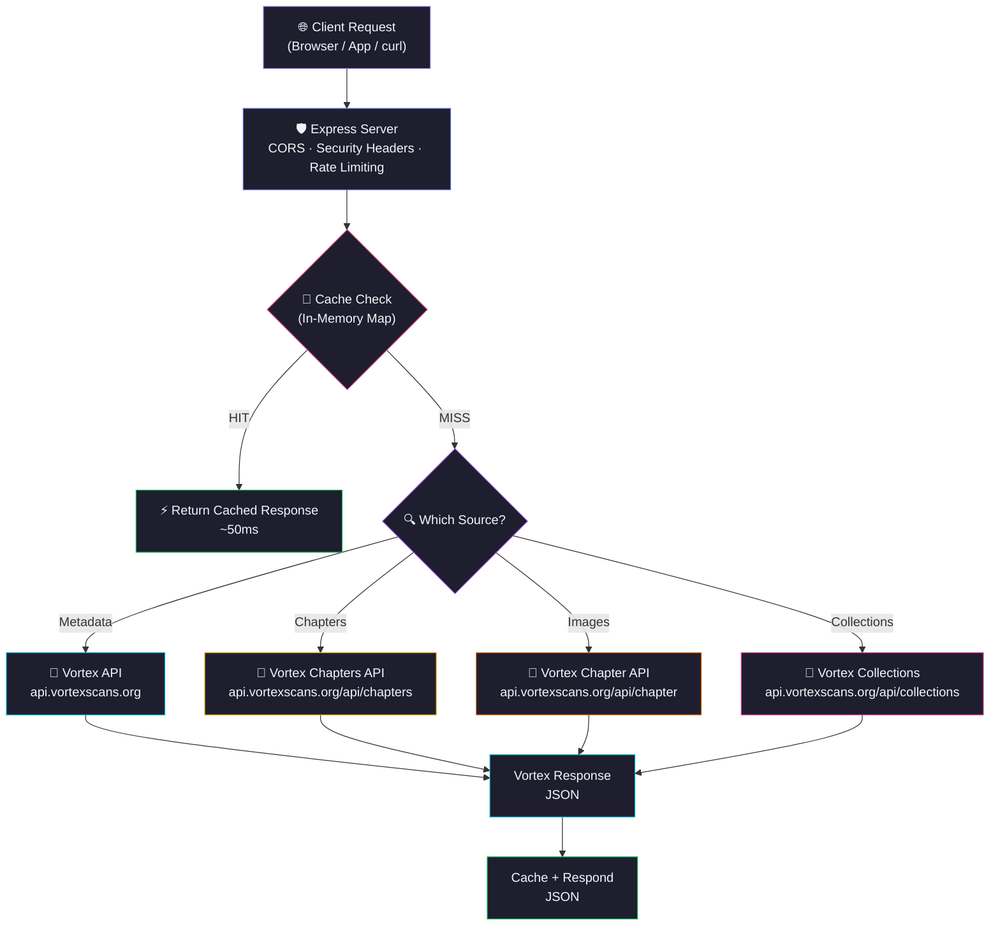
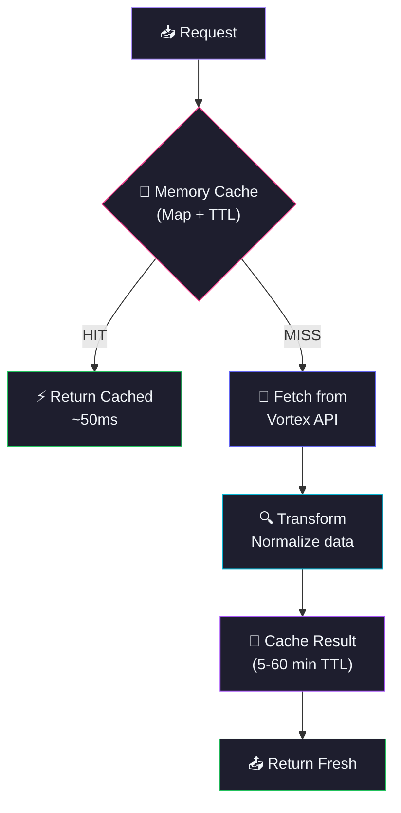

<div align="center">
  
  

</div>

<p align="center">
  <a href="https://github.com/Shineii86/VortexScansAPI/stargazers"></a>
  <a href="https://github.com/Shineii86/VortexScansAPI/network/members"></a>
  <a href="https://github.com/Shineii86/VortexScansAPI/issues"></a>
  <a href="https://github.com/Shineii86/VortexScansAPI/pulls"></a>
  <a href="https://github.com/Shineii86/VortexScansAPI/commits"></a>
  <a href="https://github.com/Shineii86/VortexScansAPI/blob/main/LICENSE"></a>
</p>

<p align="center">
  
  
  
  
  
  
  
  
  
  
</p>

<p align="center">
  <b>A complete RESTful API for manga & manhwa websites powered by Vortex Scans</b><br/>
  Search, browse, filter, read — every endpoint returns fresh data with smart caching.<br/>
  14 endpoints, 355+ manga, 65 genres, chapter images, collections, teams, health check.
</p>

<p align="center">
  <a href="#-table-of-contents">Table of Contents</a> •
  <a href="#-features">Features</a> •
  <a href="#-api-endpoints">API Docs</a> •
  <a href="#-quick-start">Quick Start</a> •
  <a href="#-deployment">Deploy</a> •
  <a href="#-contributing">Contributing</a>
</p>

---

> [!WARNING]
> 1. This `API` does not store any files — it only links to media hosted on 3rd party services.
> 2. This `API` is explicitly made for **educational purposes only** and not for commercial usage. This repo will not be responsible for any misuse of it.
> 3. All manga data, images, and content belong to their respective owners (Vortex Scans). This project is not affiliated with vortexscans.org.

---

## 📖 Table of Contents

- [Overview](#-overview)
- [Features](#-features)
- [Data Sources](#-data-sources)
- [Tech Stack](#-tech-stack)
- [Architecture](#-architecture)
- [Project Structure](#-project-structure)
- [Quick Start](#-quick-start)
- [Configuration](#-configuration)
- [API Endpoints](#-api-endpoints)
- [Reading Flow](#-reading-flow)
- [API Response Schema](#-api-response-schema)
- [Deployment](#-deployment)
- [Available Scripts](#-available-scripts)
- [Performance](#-performance)
- [Changelog Highlights](#-changelog-highlights)
- [Troubleshooting](#-troubleshooting)
- [FAQ](#-faq)
- [Roadmap](#-roadmap)
- [Contributing](#-contributing)
- [Acknowledgements](#-acknowledgements)
- [License](#-license)
- [Author](#-author)
- [Star History](#-star-history)

---

## 🌸 Overview

**VortexScansAPI** is a production-ready manga data API that fetches real-time information from **Vortex Scans** — including manga details, chapter lists, chapter images with navigation, search, filtering, collections, teams, and more — all through a clean REST API with zero database.

> 💡 No database, no auth, no complex setup. Just deploy to Vercel and you have a production API.

### Why VortexScansAPI?

- 📚 **14 Endpoints** — Complete manga data coverage
- 🔍 **Full-Text Search** — Server-side search via upstream API
- 🎯 **Advanced Filtering** — Type, status, genre, sort
- 📖 **Chapter Images** — Direct image URLs from Vortex CDN
- 🏆 **Collections** — Curated manga collections with tags
- 👥 **Teams** — Scanlation team data
- ⚡ **Smart Caching** — In-memory Map with configurable TTL
- 🔒 **CORS Enabled** — Works from any frontend, no proxy needed
- 🚀 **Zero-Config Deploy** — One click to Vercel, or run standalone with Express

### How It Works



---

## ✨ Features

<table>
  <tr>
    <td>

### ⚡ Core
- **Vortex Scans API** for rich metadata
- **Smart caching** with configurable TTL
- **14 RESTful endpoints**
- **Graceful error handling** per endpoint
- **Rate limiting** (60 req/min per IP)

    </td>
    <td>

### 🔍 Data
- **Full-text search** with server-side filtering
- **Advanced filtering** — type, status, genre, sort
- **65 genres** from upstream API
- **5 statuses** (ongoing, completed, hiatus, cancelled, dropped)
- **355+ manga** available
- **Curated collections** with works and tags

    </td>
  </tr>
  <tr>
    <td>

### 📖 Reading
- **Chapter images** from Vortex CDN
- **Chapter navigation** (previous/next)
- **Page count** per chapter
- **Series info** per chapter
- **33+ images** per chapter
- **WebP format** for faster loading

    </td>
    <td>

### 🛡️ Reliability
- **CORS enabled** — works from any frontend
- **Error responses** with descriptive messages
- **Input validation** — page/limit clamped
- **In-memory caching** — survives warm starts
- **Zero database** — pure API + cache
- **Health check** with upstream probe

    </td>
  </tr>
</table>

### 🌟 Feature Highlights

| Feature | Description | Status |
|:---|:---|:---:|
| 📚 14 API Endpoints | Complete manga data coverage | ✅ |
| 🔍 Full-Text Search | Server-side keyword search | ✅ |
| 🎯 Advanced Filtering | Type, status, genre, sort | ✅ |
| 📖 Chapter Images | Direct image URLs from CDN | ✅ |
| 🏆 Collections | Curated manga collections | ✅ |
| 👥 Teams | Scanlation team data | ✅ |
| 🔄 Smart Caching | In-memory Map with TTL | ✅ |
| 🚀 One-Click Deploy | Vercel button deployment | ✅ |
| 🏗️ Express Mode | Standalone server with `npm start` | ✅ |
| 🐳 Docker Support | Containerized deployment | ✅ |
| 📊 Health Check | Upstream probe + latency tracking | ✅ |
| 📋 Pagination Headers | Full pagination metadata | ✅ |
| 🔒 Rate Limiting | 60 req/min per IP | ✅ |
| 🔄 Legacy Redirects | Old routes → v1 routes | ✅ |

---

## 🗞️ Data Sources

### Metadata Source

| Source | API | Data |
|:---|:---|:---|
| 📚 **Vortex Query** | `api.vortexscans.org/api/query` | Manga listings, genres, filters |
| 📚 **Vortex Posts** | `api.vortexscans.org/api/posts` | Rich manga data, search, collections |
| 📚 **Vortex Chapters** | `api.vortexscans.org/api/chapters` | All chapters for a manga |
| 📚 **Vortex Chapter** | `api.vortexscans.org/api/chapter` | Chapter images + navigation |
| 📚 **Vortex Genres** | `api.vortexscans.org/api/genres` | All 65 genres |
| 📚 **Vortex Collections** | `api.vortexscans.org/api/collections` | Curated collections |
| 📚 **Vortex Teams** | `api.vortexscans.org/api/teams` | Scanlation teams |

### Image Source

| Source | Domain | Data |
|:---|:---|:---|
| 🖼️ **Vortex CDN** | `storage.vortexscans.org` | Chapter images (WebP) |

### 📚 Manga Types

| Type | Description |
|:---|:---|
| 📖 Manhwa | Korean comics |
| 📕 Manhua | Chinese comics |
| 📗 Manga | Japanese comics |

### 📊 Status Types

| Status | Description |
|:---|:---|
| 🟢 Ongoing | Currently releasing |
| ✅ Completed | Finished |
| 🟡 Hiatus | On break |
| 🔴 Cancelled | Stopped |
| ⚫ Dropped | Abandoned |

---

## 🛠️ Tech Stack

| Technology | Purpose | Version | Documentation |
|:---|:---|:---|:---|
| 🟢 [Node.js](https://nodejs.org/) | JavaScript runtime | >= 20 | [Docs](https://nodejs.org/docs/) |
| ⚡ [Express](https://expressjs.com/) | HTTP server framework | 4.21 | [Docs](https://expressjs.com/en/4x/api.html) |
| ▲ [Vercel Functions](https://vercel.com/docs/functions) | Serverless deployment | — | [Docs](https://vercel.com/docs/functions) |
| 📚 [Vortex Scans API](https://vortexscans.org) | Manga metadata API | — | [Site](https://vortexscans.org) |
| 🔒 [cors](https://github.com/expressjs/cors) | CORS middleware | 2.8 | [Docs](https://github.com/expressjs/cors) |

### 📦 Key Dependencies

```json
{
  "express": "^4.21.0",        // HTTP server
  "cors": "^2.8.5"             // CORS middleware
}
```

> 💡 Only 2 production dependencies — minimal and lightweight.

---

## 🏗️ Architecture

### Request Flow

| Stage | Component | Description |
|:-----:|-----------|-------------|
| 1 | **Client** | Browser, app, or `curl` sends request |
| 2 | **Express Server** | Routes request, applies CORS + security headers + rate limiting |
| 3 | **Cache Check** | In-memory Map with TTL — hit = instant response |
| 4 | **Fetch Data** | Vortex API endpoints |
| 5 | **Transform** | Normalize data to consistent schema |
| 6 | **Cache + Respond** | Store in cache, return JSON response |

### Caching Architecture



> 💡 In-memory `Map` cache survives across warm starts. TTL varies by endpoint (5min for manga lists, 30min for chapters, 1hr for genres).

---

## 📁 Project Structure

```
VortexScansAPI/
├── 📂 public/                              # 🌐 Static files
│   ├── 📄 index.html                       #    📖 Landing page
│   ├── 📄 docs.html                        #    📘 Swagger UI interactive documentation
│   ├── 📄 404.html                         #    ❌ Custom 404 error page
│   ├── 📄 privacy.html                     #    🔒 Privacy policy
│   ├── 📄 tos.html                         #    📋 Terms of service
│   ├── 📄 openapi.json                     #    📋 OpenAPI 3.0.3 specification
│   ├── 📄 robots.txt                       #    🤖 SEO crawl rules
│   ├── 📄 sitemap.xml                      #    🗺️ XML sitemap
│   └── 📄 manifest.json                    #    📱 PWA manifest
│
├── 📂 src/                                 # ⚙️ Core logic
│   ├── 📂 controllers/                     #    🎮 Route handlers
│   │   ├── 📄 home.controller.js           #       🏠 Home page data
│   │   ├── 📄 manga.controller.js          #       📚 Manga list, detail, chapters
│   │   ├── 📄 chapter.controller.js        #       📖 Chapter images
│   │   ├── 📄 search.controller.js         #       🔍 Search
│   │   ├── 📄 filter.controller.js         #       🎯 Advanced filter
│   │   ├── 📄 genre.controller.js          #       🏷️ Genres & status
│   │   ├── 📄 collection.controller.js     #       📦 Collections
│   │   ├── 📄 team.controller.js           #       👥 Teams
│   │   └── 📄 info.controller.js           #       ℹ️ API info
│   │
│   ├── 📂 helpers/                         #    🛠️ Integration modules
│   │   ├── 📄 cache.helper.js              #       💾 In-memory cache with TTL
│   │   ├── 📄 constants.helper.js          #       📌 API URLs, TTL config
│   │   └── 📄 fetch.helper.js              #       📡 Upstream fetch wrappers
│   │
│   └── 📂 extractors/                      #    🔄 Data transformers
│       └── 📄 manga.extractor.js           #       📊 Normalization functions
│
├── 📄 server.js                            # 🚀 Express server entry point
├── 📄 package.json                         # 📦 Dependencies & scripts
├── 📄 vercel.json                          # ▲ Vercel routing config
├── 📄 LICENSE                              # 📄 MIT License
├── 📄 CHANGELOG.md                         # 📝 Version history
└── 📄 README.md                            # 📖 This file
```

---

## 🚀 Quick Start

### Prerequisites

| Requirement | Minimum | Recommended |
|:---|:---|:---|
| 📦 Node.js | 18.x | 20.x LTS |
| 📦 npm | 9.0+ | 10.x |
| 💻 OS | Windows, macOS, Linux | Any |

### 🔧 Installation

```bash
# 1️⃣ Clone the repository
git clone https://github.com/Shineii86/VortexScansAPI.git
cd VortexScansAPI

# 2️⃣ Install dependencies
npm install

# 3️⃣ Start development server
npm run dev
```

> 🌐 Open [http://localhost:3000](http://localhost:3000) in your browser.

### 🏗️ Build for Production

```bash
# Start production server
npm start
```

### 🐳 Alternative Package Managers

```bash
# Using yarn
yarn install
yarn dev

# Using pnpm
pnpm install
pnpm dev

# Using bun
bun install
bun dev
```

---

## ⚙️ Configuration

### Environment Variables

| Variable | Default | Description |
|:---|:---|:---|
| `PORT` | `3000` | Server port (Express mode only) |

### Vercel Configuration

The `vercel.json` file handles:
- **Builds** — Maps `server.js` to `@vercel/node`
- **Routes** — All requests forwarded to Express

### Cache TTL

| Endpoint | TTL | Description |
|:---|:---|:---|
| Manga List | 5 min | Frequently updated |
| Manga Detail | 5 min | Chapter additions |
| Chapter Images | 30 min | Static content |
| Genres | 1 hr | Rarely changes |
| Collections | 30 min | Curated content |

---

## 📡 API Endpoints

### Base URL
```
https://vortexscans.vercel.app/api/v1
```

### Response Envelope

All endpoints return:
```json
{
  "success": true,
  "data": { ... },
  "pagination": { ... }
}
```

### Error Response
```json
{
  "success": false,
  "error": "Error description"
}
```

---

> ## 🏥 GET Health Check

### Endpoint

```bash
/health
```

#### Parameters

> No parameters required.

#### Example of request

```bash
curl "https://vortexscans.vercel.app/api/v1/health"
```

```javascript
import axios from "axios";
const resp = await axios.get("https://vortexscans.vercel.app/api/v1/health");
console.log(resp.data);
```

#### Sample Response

```json
{
  "success": true,
  "data": {
    "status": "ok",
    "version": "7.0.0",
    "uptime": 86400,
    "upstream": {
      "status": "ok",
      "latencyMs": 180,
      "url": "https://api.vortexscans.org"
    }
  }
}
```

---

> ## 📊 GET Stats

### Endpoint

```bash
/stats
```

#### Parameters

> No parameters required.

#### Example of request

```bash
curl "https://vortexscans.vercel.app/api/v1/stats"
```

```javascript
import axios from "axios";
const resp = await axios.get("https://vortexscans.vercel.app/api/v1/stats");
console.log(resp.data);
```

#### Sample Response

```json
{
  "success": true,
  "data": {
    "name": "VortexScansAPI",
    "version": "7.0.0",
    "uptime": 86400,
    "endpoints": [
      { "path": "/api/v1/home", "method": "GET", "description": "Home page data" },
      { "path": "/api/v1/manga", "method": "GET", "description": "List manga" }
    ],
    "rateLimit": { "limit": 60, "window": "60s", "scope": "per IP" },
    "cache": { "mangaList": "5min", "chapter": "30min", "genres": "1hr", "collections": "30min" }
  }
}
```

---

> ## 🏠 GET Home

### Endpoint

```bash
/home
```

#### Parameters

> No parameters required.

#### Example of request

```bash
curl "https://vortexscans.vercel.app/api/v1/home"
```

```javascript
import axios from "axios";
const resp = await axios.get("https://vortexscans.vercel.app/api/v1/home");
console.log(resp.data);
```

#### Sample Response

```json
{
  "success": true,
  "data": {
    "latest": [
      {
        "id": 466,
        "slug": "kidnapped-dragons",
        "title": "Kidnapped Dragons",
        "image": "https://storage.vortexscans.org/upload/...",
        "type": "manhwa",
        "status": "ongoing",
        "rating": 8.5,
        "genres": [{ "id": 1, "name": "Action" }]
      }
    ],
    "hot": [ ... ],
    "topRated": [ ... ],
    "collections": [ ... ],
    "stats": { "totalManga": 355 }
  }
}
```

---

> ## 📚 GET Manga List

### Endpoint

```bash
/manga
```

#### Parameters

| Parameter | Type | Mandatory | Default | Description |
| :-------: | :--: | :-------: | :-----: | :---------: |
| `page` | `number` | No | `1` | Page number |
| `limit` | `number` | No | `48` | Results per page (max 100) |
| `type` | `string` | No | — | manhwa / manga / manhua |
| `status` | `string` | No | — | ongoing / hiatus / completed / cancelled / dropped |
| `genre` | `string` | No | — | Genre ID |
| `order` | `string` | No | — | Sort field |
| `direction` | `string` | No | — | asc / desc |
| `hot` | `boolean` | No | — | Hot manga filter |

#### Example of request

```bash
curl "https://vortexscans.vercel.app/api/v1/manga?limit=3&type=manhwa"
```

```javascript
import axios from "axios";
const resp = await axios.get("https://vortexscans.vercel.app/api/v1/manga", {
  params: { limit: 3, type: "manhwa" }
});
console.log(resp.data);
```

#### Sample Response

```json
{
  "success": true,
  "data": [
    {
      "id": 466,
      "slug": "kidnapped-dragons",
      "title": "Kidnapped Dragons",
      "image": "https://storage.vortexscans.org/upload/...",
      "type": "manhwa",
      "status": "ongoing",
      "hot": false,
      "pinned": false,
      "rating": 8.5,
      "genres": [{ "id": 1, "name": "Action" }],
      "chapters": [ ... ]
    }
  ],
  "pagination": {
    "total": 355,
    "perPage": 3,
    "currentPage": 1,
    "lastPage": 119,
    "hasNext": true,
    "hasPrevious": false
  }
}
```

---

> ## 📖 GET Manga Detail

### Endpoint

```bash
/manga/:slug
```

#### Parameters

| Parameter | Type | Mandatory | Default | Description |
| :-------: | :--: | :-------: | :-----: | :---------: |
| `slug` | `string` | Yes ✔️ | — | Manga slug |
| `page` | `number` | No | `1` | Chapter page |
| `limit` | `number` | No | `100` | Chapters per page (max 100) |

#### Example of request

```bash
curl "https://vortexscans.vercel.app/api/v1/manga/kidnapped-dragons"
```

```javascript
import axios from "axios";
const resp = await axios.get("https://vortexscans.vercel.app/api/v1/manga/kidnapped-dragons");
console.log(resp.data);
```

#### Sample Response

```json
{
  "success": true,
  "data": {
    "id": 466,
    "slug": "kidnapped-dragons",
    "title": "Kidnapped Dragons",
    "alternativeTitles": "How to Kidnap a Dragon / Kidnap a Dragon",
    "image": "https://storage.vortexscans.org/upload/...",
    "type": "manhwa",
    "status": "ongoing",
    "hot": false,
    "isNew": true,
    "pinned": false,
    "rating": 8.5,
    "totalViews": 0,
    "releaseDate": "2025",
    "lastChapterAddedAt": "2026-06-13",
    "genres": [{ "id": 1, "name": "Action" }],
    "chapters": [
      {
        "id": 27906,
        "number": 46,
        "title": null,
        "slug": "chapter-46",
        "createdAt": "2026-06-13",
        "locked": false,
        "accessible": true,
        "price": 0,
        "likesCount": 0,
        "commentsCount": 0
      }
    ]
  },
  "pagination": {
    "total": 46,
    "perPage": 100,
    "currentPage": 1,
    "lastPage": 1,
    "hasNext": false,
    "hasPrevious": false
  }
}
```

---

> ## 📋 GET Manga Chapters

### Endpoint

```bash
/manga/:slug/chapters
```

#### Parameters

| Parameter | Type | Mandatory | Default | Description |
| :-------: | :--: | :-------: | :-----: | :---------: |
| `slug` | `string` | Yes ✔️ | — | Manga slug |
| `page` | `number` | No | `1` | Page number |
| `limit` | `number` | No | `100` | Results per page (max 100) |

#### Example of request

```bash
curl "https://vortexscans.vercel.app/api/v1/manga/kidnapped-dragons/chapters?limit=5"
```

```javascript
import axios from "axios";
const resp = await axios.get("https://vortexscans.vercel.app/api/v1/manga/kidnapped-dragons/chapters", {
  params: { limit: 5 }
});
console.log(resp.data);
```

#### Sample Response

```json
{
  "success": true,
  "data": {
    "manga": {
      "id": 466,
      "slug": "kidnapped-dragons",
      "title": "Kidnapped Dragons",
      "image": "https://storage.vortexscans.org/upload/..."
    },
    "chapters": [
      {
        "id": 27906,
        "number": 46,
        "title": null,
        "slug": "chapter-46",
        "createdAt": "2026-06-13",
        "updatedAt": "2026-06-13",
        "locked": false,
        "accessible": true,
        "price": 0,
        "likesCount": 0,
        "commentsCount": 0,
        "url": "https://vortexscans.org/series/kidnapped-dragons/chapter-46"
      }
    ]
  },
  "pagination": {
    "total": 46,
    "perPage": 5,
    "currentPage": 1,
    "lastPage": 10,
    "hasNext": true,
    "hasPrevious": false
  }
}
```

---

> ## 📖 GET Chapter Images

### Endpoint

```bash
/chapter/:chapterId
```

#### Parameters

| Parameter | Type | Mandatory | Default | Description |
| :-------: | :--: | :-------: | :-----: | :---------: |
| `chapterId` | `number` | Yes ✔️ | — | Chapter ID |

#### Example of request

```bash
curl "https://vortexscans.vercel.app/api/v1/chapter/27550"
```

```javascript
import axios from "axios";
const resp = await axios.get("https://vortexscans.vercel.app/api/v1/chapter/27550");
console.log(resp.data);
```

#### Sample Response

```json
{
  "success": true,
  "data": {
    "id": 27550,
    "slug": "chapter-44",
    "number": 44,
    "title": null,
    "pageCount": 33,
    "images": [
      "https://storage.vortexscans.org/upload/series/.../01.webp",
      "https://storage.vortexscans.org/upload/series/.../02.webp"
    ],
    "series": {
      "id": 466,
      "title": "Kidnapped Dragons",
      "slug": "kidnapped-dragons"
    },
    "team": null,
    "navigation": {
      "previous": {
        "slug": "chapter-43",
        "number": 43,
        "title": "",
        "url": "https://vortexscans.org/series/kidnapped-dragons/chapter-43"
      },
      "next": {
        "slug": "chapter-45",
        "number": 45,
        "title": "",
        "url": "https://vortexscans.org/series/kidnapped-dragons/chapter-45"
      }
    }
  }
}
```

---

> ## 🔍 GET Search

### Endpoint

```bash
/search
```

#### Parameters

| Parameter | Type | Mandatory | Default | Description |
| :-------: | :--: | :-------: | :-----: | :---------: |
| `q` | `string` | Yes ✔️ | — | Search keyword |
| `page` | `number` | No | `1` | Page number |
| `limit` | `number` | No | `20` | Results per page (max 100) |

#### Example of request

```bash
curl "https://vortexscans.vercel.app/api/v1/search?q=dragon&limit=3"
```

```javascript
import axios from "axios";
const resp = await axios.get("https://vortexscans.vercel.app/api/v1/search", {
  params: { q: "dragon", limit: 3 }
});
console.log(resp.data);
```

#### Sample Response

```json
{
  "success": true,
  "data": [
    {
      "id": 466,
      "slug": "kidnapped-dragons",
      "title": "Kidnapped Dragons",
      "image": "https://storage.vortexscans.org/upload/...",
      "type": "manhwa",
      "status": "ongoing",
      "rating": 8.5
    }
  ],
  "pagination": {
    "total": 343,
    "perPage": 3,
    "currentPage": 1,
    "lastPage": 115,
    "hasNext": true,
    "hasPrevious": false
  }
}
```

---

> ## 🎯 GET Filter

### Endpoint

```bash
/filter
```

#### Parameters

| Parameter | Type | Mandatory | Default | Description |
| :-------: | :--: | :-------: | :-----: | :---------: |
| `type` | `string` | No | — | manhwa / manga / manhua |
| `status` | `string` | No | — | ongoing / completed / hiatus |
| `genre` | `string` | No | — | Genre ID |
| `sort` | `string` | No | — | Sort field |
| `page` | `number` | No | `1` | Page number |
| `limit` | `number` | No | `48` | Results per page (max 100) |

#### Example of request

```bash
curl "https://vortexscans.vercel.app/api/v1/filter?type=manhwa&status=ongoing&limit=3"
```

```javascript
import axios from "axios";
const resp = await axios.get("https://vortexscans.vercel.app/api/v1/filter", {
  params: { type: "manhwa", status: "ongoing", limit: 3 }
});
console.log(resp.data);
```

#### Sample Response

```json
{
  "success": true,
  "data": [ ... ],
  "pagination": {
    "total": 337,
    "perPage": 3,
    "currentPage": 1,
    "lastPage": 113,
    "hasNext": true,
    "hasPrevious": false
  }
}
```

---

> ## 🏷️ GET Genres

### Endpoint

```bash
/genres
```

#### Parameters

> No parameters required.

#### Example of request

```bash
curl "https://vortexscans.vercel.app/api/v1/genres"
```

```javascript
import axios from "axios";
const resp = await axios.get("https://vortexscans.vercel.app/api/v1/genres");
console.log(resp.data);
```

#### Sample Response

```json
{
  "success": true,
  "data": [
    { "id": 1, "name": "Action" },
    { "id": 2, "name": "Adventure" },
    { "id": 3, "name": "Comedy" },
    { "id": 4, "name": "Drama" },
    { "id": 5, "name": "Fantasy" },
    { "id": 6, "name": "Horror" }
  ]
}
```

---

> ## 📋 GET Status

### Endpoint

```bash
/status
```

#### Parameters

> No parameters required.

#### Example of request

```bash
curl "https://vortexscans.vercel.app/api/v1/status"
```

```javascript
import axios from "axios";
const resp = await axios.get("https://vortexscans.vercel.app/api/v1/status");
console.log(resp.data);
```

#### Sample Response

```json
{
  "success": true,
  "data": {
    "statuses": [
      { "id": "ongoing", "name": "Ongoing" },
      { "id": "hiatus", "name": "Hiatus" },
      { "id": "completed", "name": "Completed" },
      { "id": "cancelled", "name": "Cancelled" },
      { "id": "dropped", "name": "Dropped" }
    ],
    "types": [
      { "id": "manhwa", "name": "Manhwa" },
      { "id": "manhua", "name": "Manhua" },
      { "id": "manga", "name": "Manga" }
    ]
  }
}
```

---

> ## 📦 GET Collections

### Endpoint

```bash
/collections
```

#### Parameters

> No parameters required.

#### Example of request

```bash
curl "https://vortexscans.vercel.app/api/v1/collections"
```

```javascript
import axios from "axios";
const resp = await axios.get("https://vortexscans.vercel.app/api/v1/collections");
console.log(resp.data);
```

#### Sample Response

```json
{
  "success": true,
  "data": [
    {
      "id": 1,
      "slug": "for-beginners",
      "title": "For beginners",
      "description": "New to the platform? These are the easiest and most popular stories to start with.",
      "coverImage": "https://storage.vortexscans.org/upload/...",
      "bannerImage": null,
      "worksCount": 11,
      "likesCount": 50,
      "totalViews": 0
    }
  ]
}
```

---

> ## 📖 GET Collection Detail

### Endpoint

```bash
/collections/:slug
```

#### Parameters

| Parameter | Type | Mandatory | Default | Description |
| :-------: | :--: | :-------: | :-----: | :---------: |
| `slug` | `string` | Yes ✔️ | — | Collection slug |

#### Example of request

```bash
curl "https://vortexscans.vercel.app/api/v1/collections/for-beginners"
```

```javascript
import axios from "axios";
const resp = await axios.get("https://vortexscans.vercel.app/api/v1/collections/for-beginners");
console.log(resp.data);
```

#### Sample Response

```json
{
  "success": true,
  "data": {
    "id": 1,
    "slug": "for-beginners",
    "title": "For beginners",
    "description": "New to the platform? These are the easiest and most popular stories to start with.",
    "coverImage": "https://storage.vortexscans.org/upload/...",
    "bannerImage": null,
    "artworkImage": null,
    "totalViews": 0,
    "likesCount": 50,
    "worksCount": 11,
    "tags": ["Action", "Adventure", "Fantasy"],
    "works": [
      {
        "position": 1,
        "id": 466,
        "slug": "kidnapped-dragons",
        "title": "Kidnapped Dragons",
        "image": "https://storage.vortexscans.org/upload/...",
        "type": "manhwa",
        "rating": 8.5,
        "genres": [{ "id": 1, "name": "Action" }]
      }
    ]
  }
}
```

---

> ## 👥 GET Teams

### Endpoint

```bash
/teams
```

#### Parameters

| Parameter | Type | Mandatory | Default | Description |
| :-------: | :--: | :-------: | :-----: | :---------: |
| `page` | `number` | No | `1` | Page number |
| `perPage` | `number` | No | `20` | Results per page |

#### Example of request

```bash
curl "https://vortexscans.vercel.app/api/v1/teams"
```

```javascript
import axios from "axios";
const resp = await axios.get("https://vortexscans.vercel.app/api/v1/teams");
console.log(resp.data);
```

#### Sample Response

```json
{
  "success": true,
  "data": [
    {
      "id": 1,
      "slug": "vine-novels",
      "name": "Vine Novels",
      "type": "Team",
      "avatarUrl": null,
      "description": "The Legend Himself.",
      "bio": "Him.",
      "isVerified": true,
      "socialLinks": [],
      "stats": {
        "members": 1,
        "chapters": 0,
        "posts": 0,
        "likes": 0
      }
    }
  ],
  "pagination": {
    "total": 1,
    "perPage": 20,
    "currentPage": 1,
    "lastPage": 1,
    "hasNext": false,
    "hasPrevious": false
  }
}
```

---

## 📖 Reading Flow

To read a manga chapter, follow these 3 steps:

```bash
# Step 1: Get manga list (find slug)
curl "https://vortexscans.vercel.app/api/v1/manga?limit=1"
# => data[0].slug = "kidnapped-dragons"

# Step 2: Get chapters (find chapter ID)
curl "https://vortexscans.vercel.app/api/v1/manga/kidnapped-dragons/chapters?limit=1"
# => data.chapters[0].id = 27906

# Step 3: Get chapter images
curl "https://vortexscans.vercel.app/api/v1/chapter/27906"
# => data.images = ["https://storage.vortexscans.org/upload/.../01.webp", ...]
```

### 📚 Navigation

Chapters include previous/next navigation:

```javascript
const chapter = await fetch("/api/v1/chapter/27550").then(r => r.json());
const { previous, next } = chapter.data.navigation;

if (previous) console.log(`Previous: Chapter ${previous.number}`);
if (next) console.log(`Next: Chapter ${next.number}`);
```

### 🖼️ Image Viewer

```html
<div id="reader"></div>
<script>
  const images = [ /* From /api/v1/chapter/:id response */ ];
  const reader = document.getElementById('reader');
  
  images.forEach(url => {
    const img = document.createElement('img');
    img.src = url;
    img.style.width = '100%';
    reader.appendChild(img);
  });
</script>
```

---

## 📋 API Response Schema

### Success Response
```json
{
  "success": true,
  "data": { ... },
  "pagination": { ... }
}
```

### Error Response
```json
{
  "success": false,
  "error": "Error description"
}
```

### Manga Item Object

| Field | Type | Description | Example |
|:---|:---|:---|:---|
| `id` | `number` | Vortex ID | `466` |
| `slug` | `string` | URL-friendly slug | `"kidnapped-dragons"` |
| `title` | `string` | Manga title | `"Kidnapped Dragons"` |
| `image` | `string` | Cover image URL | `"https://storage..."` |
| `type` | `string` | manhwa / manga / manhua | `"manhwa"` |
| `status` | `string` | ongoing / completed / hiatus | `"ongoing"` |
| `rating` | `number` | User rating | `8.5` |
| `genres` | `array` | Genre list | `[{ id: 1, name: "Action" }]` |

### Chapter Object

| Field | Type | Description | Example |
|:---|:---|:---|:---|
| `id` | `number` | Chapter ID | `27906` |
| `number` | `number` | Chapter number | `46` |
| `title` | `string` | Chapter title | `null` |
| `slug` | `string` | URL-friendly slug | `"chapter-46"` |
| `createdAt` | `string` | Creation date | `"2026-06-13"` |
| `locked` | `boolean` | Is locked | `false` |
| `accessible` | `boolean` | Is accessible | `true` |

### Pagination Object

| Field | Type | Description | Example |
|:---|:---|:---|:---|
| `total` | `number` | Total items | `355` |
| `perPage` | `number` | Items per page | `20` |
| `currentPage` | `number` | Current page | `1` |
| `lastPage` | `number` | Last page | `18` |
| `hasNext` | `boolean` | More pages? | `true` |
| `hasPrevious` | `boolean` | Previous pages? | `false` |

---

## 🌐 Deployment

### ▲ Vercel (Recommended)

[](https://vercel.com/new/clone?repository-url=https://github.com/Shineii86/VortexScansAPI)

1. Click the button above (or import manually on vercel.com)
2. Vercel auto-detects the project — **no config needed**
3. Your API is live! 🎉

```bash
# Or use Vercel CLI
npx vercel --prod
```

### 🖥️ Standalone Server

```bash
# Clone and install
git clone https://github.com/Shineii86/VortexScansAPI.git
cd VortexScansAPI && npm install

# Start production server
npm start
# → http://localhost:3000
```

### 🐳 Docker

```bash
# Build
docker build -t vortexscansapi .

# Run
docker run -p 3000:3000 vortexscansapi
```

---

## 📜 Available Scripts

| Command | Description | Details |
|:---|:---|:---|
| `npm run dev` | 🔥 Start development server | Runs on `localhost:3000` |
| `npm start` | 🚀 Start production server | `node server.js` |

---

## ⚡ Performance

| Metric | Value |
|:---|:---|
| ⚡ Cold start | ~500ms |
| 🔄 Warm response | ~50-200ms |
| 💾 Cache hit | ~10ms |
| 💾 Cache TTL | 5-60 minutes |
| ⏱️ Rate limit | 60 req/min/IP |
| 📦 Dependencies | 2 only |

### Optimization Features

- 💾 **In-memory cache** — Map-based with TTL expiration
- ⚡ **Minimal deps** — Only 2 production dependencies
- 🎯 **Selective fetching** — Only Vortex API endpoints needed
- 🔄 **Graceful fallback** — Empty arrays on error, never crashes
- 📡 **Legacy redirects** — Old routes → v1 routes

---

## 📝 Changelog Highlights

| Version | Date | Key Changes |
|:---|:---|:---|
| **7.0.0** | 2026-06-13 | `/api/v1/` routes, consistent envelope, health check, collections, teams, rate limit headers, pagination headers |
| **6.2.0** | 2026-06-13 | Fixed chapter images, input validation |
| **6.1.0** | 2026-06-11 | Fixed chapter navigation, search/genre filtering |
| **6.0.0** | 2026-06-11 | Express server architecture |
| **5.0.0** | 2026-06-11 | API documentation |
| **4.0.0** | 2026-06-11 | Landing page, 404 page, OpenAPI spec |
| **3.1.0** | 2026-06-11 | Code style refactor |
| **3.0.0** | 2026-06-11 | Full API with chapters, images, search, filters |
| **2.0.0** | 2026-06-11 | Controllers/extractors/helpers architecture |
| **1.1.0** | 2026-06-11 | Next.js to Vercel migration |
| **1.0.0** | 2026-06-11 | Initial release |

> 📝 See [CHANGELOG.md](./CHANGELOG.md) for the full version history.

---

## 🔧 Troubleshooting

| Problem | Cause | Solution |
|:---|:---|:---|
| ❌ `npm install` fails | Node.js version too old | Upgrade to Node.js 18+ (`node -v`) |
| ❌ CORS errors | Frontend domain blocked | CORS is `*` — check browser extension |
| ❌ 404 on API routes | Wrong URL format | Use `/api/v1/` prefix, not just `/` |
| ❌ Empty chapters | Wrong slug | Check manga slug via `/api/v1/manga?limit=1` |
| ❌ Deploy fails on Vercel | Build error | Check `node server.js` locally first |
| ❌ Slow first request | Serverless cold start | Normal — first request after idle takes ~500ms |
| ❌ Rate limited | Too many requests | Cache reduces this — wait for TTL expiry |
| ❌ 0 chapter images | Using slug instead of ID | Use `/api/v1/chapter/:chapterId` with numeric ID |

### 🐛 Debug Mode

```bash
# Run with verbose logging
NODE_ENV=development npm run dev

# Test specific endpoint
curl http://localhost:3000/api/v1/health
curl http://localhost:3000/api/v1/search?q=dragon
curl http://localhost:3000/api/v1/chapter/27550
```

---

## ❓ FAQ

<details>
<summary><b>🔍 How do I search for manga?</b></summary>
<br/>
Use <code>/api/v1/search?q=your+search</code>. Results include title, cover, type, status, and rating. Server-side filtering via upstream API.
</details>

<details>
<summary><b>📖 How do I get chapter images?</b></summary>
<br/>
Use <code>/api/v1/chapter/:chapterId</code> where <code>:chapterId</code> is the numeric chapter ID (e.g., <code>27550</code>). The response includes image URLs from Vortex CDN and navigation for prev/next chapters.
</details>

<details>
<summary><b>🎯 How does filtering work?</b></summary>
<br/>
Use <code>/api/v1/filter</code> with query params. Combine <code>type</code>, <code>status</code>, <code>genre</code>, and <code>sort</code> for advanced filtering. All params are optional.
</details>

<details>
<summary><b>📡 Can I use this in my frontend app?</b></summary>
<br/>
Yes! CORS is enabled for all origins (<code>*</code>). Just make fetch requests to the API endpoints. No API key needed. Example: <code>fetch('https://vortexscans.vercel.app/api/v1/search?q=dragon')</code>
</details>

<details>
<summary><b>🔄 How often does the data refresh?</b></summary>
<br/>
The cache TTL is 5-60 minutes depending on the endpoint. After that, the next request triggers a fresh fetch from Vortex API.
</details>

<details>
<summary><b>🌐 Can I self-host this?</b></summary>
<br/>
Yes! Use <code>npm start</code> to run the Express server on any VPS, Docker container, or PaaS. The Vercel serverless functions are optional — <code>server.js</code> handles everything.
</details>

<details>
<summary><b>📚 Which manga types are supported?</b></summary>
<br/>
3 types: Manhwa (Korean), Manhua (Chinese), Manga (Japanese). All available via the <code>type</code> filter parameter.
</details>

---

## 🗺️ Roadmap

### 🎯 Planned Features

- [ ] 🔐 **API key authentication** — Per-user rate limits
- [ ] 📊 **Analytics endpoint** — Usage statistics
- [ ] 🌙 **Dark/light mode** — Theme toggle for landing page
- [ ] 📱 **PWA support** — Install as app on mobile
- [ ] 🔔 **Webhook notifications** — Push new chapters to Discord
- [ ] 🗄️ **Redis cache** — Persistent caching for serverless
- [ ] 🌐 **Multi-language** — Sub/dub language metadata
- [ ] 📦 **NPM package** — Client SDK for easy integration

### ✅ Completed

- [x] 📚 14 API endpoints covering all data
- [x] 🔍 Full-text search with server-side filtering
- [x] 🎯 Advanced filtering (type, status, genre, sort)
- [x] 📖 Chapter images from Vortex CDN
- [x] 🏆 Curated collections with works and tags
- [x] 👥 Scanlation team data
- [x] 🔄 Smart caching with configurable TTL
- [x] 🚀 One-click Vercel deployment
- [x] 🐳 Docker support
- [x] 📘 Swagger UI interactive docs
- [x] 📊 Health check with upstream probe
- [x] 📋 Pagination headers on all paginated endpoints
- [x] 🔒 Rate limiting with headers
- [x] 🔄 Legacy redirects from old routes

---

## 🤝 Contributing

*Contributions are welcome and appreciated! Here's how you can help:*

<table>
<tr>
<td width="25%" align="center">

### 🐛 Report Bugs
Found something broken?

[Open an Issue](https://github.com/Shineii86/VortexScansAPI/issues)

</td>
<td width="25%" align="center">

### 💡 Suggest Features
Have an idea?

[Start a Discussion](https://github.com/Shineii86/VortexScansAPI/issues)

</td>
<td width="25%" align="center">

### 🔀 Submit PRs
Ready to contribute code?

[Fork & Submit](https://github.com/Shineii86/VortexScansAPI/fork)

</td>
</tr>
</table>

### 🔄 How to Contribute

```bash
# 1️⃣ Fork the repository
# Click the "Fork" button on GitHub

# 2️⃣ Clone your fork
git clone https://github.com/YOUR_USERNAME/VortexScansAPI.git
cd VortexScansAPI

# 3️⃣ Create a feature branch
git checkout -b feature/amazing-feature

# 4️⃣ Make your changes
# Edit files, add features, fix bugs...

# 5️⃣ Commit your changes
git commit -m 'feat: add amazing feature'

# 6️⃣ Push to your fork
git push origin feature/amazing-feature

# 7️⃣ Open a Pull Request
# Go to GitHub and create a PR
```

### 📋 Guidelines

- ✅ Follow the existing code style and documentation conventions
- ✅ Write meaningful commit messages (use [conventional commits](https://www.conventionalcommits.org/))
- ✅ Update CHANGELOG.md with your changes
- ✅ Keep PRs focused — one feature or fix per PR
- ✅ Add JSDoc comments for new functions
- ❎ Don't commit `node_modules` or cache files
- ❎ Don't add unrelated changes to a single PR

---

## 🙏 Acknowledgements

### 📚 Data Sources

| Source | About |
|:---|:---|
| [Vortex Scans](https://vortexscans.org) | Manga website — source for all manga data |
| [Vortex API](https://api.vortexscans.org) | Upstream API for manga metadata |
| [Vortex CDN](https://storage.vortexscans.org) | CDN for chapter images |

### 🛠️ Technologies

- **[Express](https://expressjs.com/)** — Fast, unopinionated web framework
- **[Vortex Scans API](https://vortexscans.org)** — Manga metadata
- **[Vercel](https://vercel.com/)** — Serverless deployment platform

### 📝 Resources

- [Shields.io](https://shields.io/) — Badges for README
- [Star History](https://star-history.com/) — GitHub star history charts
- [Capsule Render](https://github.com/kyechan99/capsule-render) — Header banner generator

---

## 📄 License

<div align="center">

[](./LICENSE)

This project is licensed under the **MIT License**.

Free to use, modify, and distribute — see the [LICENSE](LICENSE) file for details.

</div>

---

## 👤 Author

<div align="center">

  <a href="https://github.com/Shineii86/VortexScansAPI">
  
  </a>
  
</div>
  
<p align="center">
  <b style="font-size: 5.5em;">Shinei Nouzen</b>
  <br/>
  <sub>Full-Stack Developer & Anime Enthusiast</sub>
  <br/><br/>
  <a href="https://github.com/Shineii86"></a>
  <a href="https://telegram.me/Shineii86"></a>
  <a href="https://instagram.com/ikx7.a"></a>
  <a href="mailto:ikx7a@hotmail.com"></a>
</p>

---

## ⭐ Star History

<p align="center">
  <a href="https://star-history.com/#Shineii86/VortexScansAPI&Date">
    
  </a>
</p>

> ⭐ If you found this project useful, please consider giving it a star!

---

<div align="center">
  <p align="center">
    <b>Made With ❤️ For The Manga Community</b>
    <br/><br/>
    <sub>© Shinei Nouzen. All Rights Reserved.</sub>
  </p>
</div>
