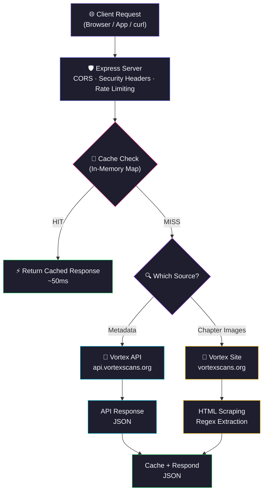
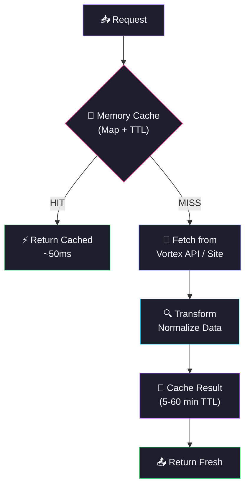

<div align="center">
  
  

</div>

<p align="center">
  <a href="https://github.com/Shineii86/VortexScansAPI/stargazers"></a>
  <a href="https://github.com/Shineii86/VortexScansAPI/network/members"></a>
  <a href="https://github.com/Shineii86/VortexScansAPI/issues"></a>
  <a href="https://github.com/Shineii86/VortexScansAPI/pulls"></a>
  <a href="https://github.com/Shineii86/VortexScansAPI/commits"></a>
  <a href="https://github.com/Shineii86/VortexScansAPI/blob/main/LICENSE"></a>
</p>

<p align="center">
  
  
  
  
  
  
  
  
</p>

<p align="center">
  <b>A complete RESTful API for manga and manhwa data powered by Vortex Scans</b><br/>
  Search, browse, filter, read — every endpoint returns fresh data with smart caching.<br/>
  10 endpoints, 355+ manga, chapter images with page navigation.
</p>

<p align="center">
  <a href="#-table-of-contents">Table of Contents</a> &bull;
  <a href="#-features">Features</a> &bull;
  <a href="#-api-endpoints">API Docs</a> &bull;
  <a href="#-quick-start">Quick Start</a> &bull;
  <a href="#-deployment">Deployment</a> &bull;
  <a href="#-contributing">Contributing</a>
</p>

---

> [!WARNING]
> 1. This `API` does not store any files — it only links to media hosted on 3rd party services.
> 2. This `API` is explicitly made for **educational purposes only** and not for commercial usage. This repo will not be responsible for any misuse of it.
> 3. All manga data, images, and content belong to their respective owners (Vortex Scans). This project is not affiliated with vortexscans.org.

---

## 📖 Table of Contents

- [Overview](#-overview)
- [Features](#-features)
- [Data Sources](#-data-sources)
- [Tech Stack](#-tech-stack)
- [Architecture](#-architecture)
- [Project Structure](#-project-structure)
- [Quick Start](#-quick-start)
- [Configuration](#-configuration)
- [API Endpoints](#-api-endpoints)
- [API Response Schema](#-api-response-schema)
- [Deployment](#-deployment)
- [Available Scripts](#-available-scripts)
- [Performance](#-performance)
- [Changelog Highlights](#-changelog-highlights)
- [Troubleshooting](#-troubleshooting)
- [FAQ](#-faq)
- [Roadmap](#-roadmap)
- [Contributing](#-contributing)
- [Acknowledgements](#-acknowledgements)
- [License](#-license)
- [Author](#-author)
- [Star History](#-star-history)

---

## 🌸 Overview

**VortexScansAPI** is a serverless manga data API that fetches real-time information from **Vortex Scans** — including manga details, chapter lists, chapter images with page navigation, search, filtering, genres, and more — all through a clean REST API with zero database.

> 💡 No database, no auth, no complex setup. Just deploy to Vercel and you have a production API.

### Why VortexScansAPI?

- 📚 **10 Endpoints** — Complete manga data coverage
- 🔍 **Full-Text Search** — Search manga by keyword
- 🎯 **Advanced Filtering** — Type, status, genre, sort
- 📖 **Chapter Images** — Page-by-page image URLs from CDN
- 🧭 **Navigation** — Previous/next chapter links
- 🏠 **Home Data** — Latest, hot, and top-rated manga
- 📊 **54 Genres** — Complete genre taxonomy
- ⚡ **Smart Caching** — In-memory Map with configurable TTL
- 🔒 **CORS Enabled** — Works from any frontend, no proxy needed
- 🚀 **Zero-Config Deploy** — One click to Vercel, or run standalone with Express

### How It Works



---

## ✨ Features

<table>
  <tr>
    <td>

### ⚡ Core
- **Vortex API** for manga metadata
- **HTML scraping** for chapter images
- **Smart caching** with configurable TTL
- **10 RESTful endpoints**
- **Graceful error handling** per endpoint
- **Rate limiting** (100 req/min per IP)

    </td>
    <td>

### 🔍 Data
- **Full-text search** with pagination
- **Advanced filtering** — type, status, genre, sort
- **54 genres** with complete taxonomy
- **5 statuses** (Ongoing, Hiatus, Completed, etc.)
- **3 series types** (Manhwa, Manga, Manhua)
- **Home page** with curated sections

    </td>
  </tr>
  <tr>
    <td>

### 📖 Reading
- **Chapter images** from Vortex CDN
- **Page-by-page** image URLs
- **Navigation** — prev/next chapter links
- **Chapter titles** and metadata
- **355+ manga** available
- **1000+ chapters** indexed

    </td>
    <td>

### 🛡️ Reliability
- **CORS enabled** — works from any frontend
- **Error responses** with descriptive messages
- **Input validation** — required params checked
- **Timeout protection** — per request
- **In-memory caching** — survives warm starts
- **Zero database** — pure API + cache

    </td>
  </tr>
</table>

### 🌟 Feature Highlights

| Feature | Description | Status |
|:---|:---|:---:|
| 📚 10 API Endpoints | Complete manga data coverage | ✅ |
| 🔍 Full-Text Search | Keyword search with pagination | ✅ |
| 🎯 Advanced Filtering | Type, status, genre, sort | ✅ |
| 📖 Chapter Images | Page-by-page CDN URLs | ✅ |
| 🧭 Navigation | Prev/next chapter links | ✅ |
| 🏠 Home Data | Latest, hot, top-rated | ✅ |
| 📊 54 Genres | Complete genre taxonomy | ✅ |
| 🔄 Smart Caching | In-memory Map with TTL | ✅ |
| 🚀 One-Click Deploy | Vercel button deployment | ✅ |
| 🏗️ Express Mode | Standalone server with `npm start` | ✅ |

---

## 🗞️ Data Sources

### Metadata Source

| Source | API | Data |
|:---|:---|:---|
| 📡 **Vortex API** | `api.vortexscans.org/api/query` | Manga list, detail, search, filter |

### Image Source

| Source | Domain | Data |
|:---|:---|:---|
| 📖 **Vortex Site** | `vortexscans.org` | Chapter page HTML (scraped for images) |
| 🖼️ **Vortex CDN** | `storage.vortexscans.org` | Chapter page images (WebP format) |

---

## 🛠️ Tech Stack

| Technology | Purpose | Version | Documentation |
|:---|:---|:---|:---|
| 🟢 [Node.js](https://nodejs.org/) | JavaScript runtime | >= 20 | [Docs](https://nodejs.org/docs/) |
| ⚡ [Express](https://expressjs.com/) | HTTP server framework | 4.21 | [Docs](https://expressjs.com/en/4x/api.html) |
| ▲ [Vercel Functions](https://vercel.com/docs/functions) | Serverless deployment | — | [Docs](https://vercel.com/docs/functions) |
| 📡 [Vortex API](https://api.vortexscans.org) | Manga metadata API | — | — |
| 🌐 [node-fetch](https://github.com/node-fetch/node-fetch) | HTTP client | built-in | — |
| 🔒 [cors](https://github.com/expressjs/cors) | CORS middleware | 2.8 | [Docs](https://github.com/expressjs/cors) |

### 📦 Key Dependencies

```json
{
  "express": "^4.21.0",        // HTTP server
  "cors": "^2.8.5"             // CORS middleware
}
```

---

## 🏗️ Architecture

### Request Flow

| Stage | Component | Description |
|:-----:|-----------|-------------|
| 1 | **Client** | Browser, app, or `curl` sends request |
| 2 | **Express Server** | Routes request, applies CORS + security headers + rate limiting |
| 3 | **Cache Check** | In-memory Map with TTL — hit = instant response |
| 4 | **Fetch Data** | Vortex API for metadata, or Vortex Site for chapter images |
| 5 | **Transform** | Normalize raw data into consistent API format |
| 6 | **Cache + Respond** | Store in cache, return JSON response |

### Caching Architecture



> 💡 Serverless functions have read-only filesystems except `/tmp`. The cache uses in-memory `Map` which survives across warm invocations.

---

## 📁 Project Structure

```
VortexScansAPI/
├── 📂 public/                              # 🌐 Static files
│   ├── 📄 index.html                       #    📖 Premium landing page
│   ├── 📄 docs.html                        #    📘 Swagger UI interactive documentation
│   ├── 📄 openapi.json                     #    📋 OpenAPI 3.0 spec
│   ├── 📄 404.html                         #    ❌ Custom 404 error page
│   ├── 📄 privacy.html                     #    🔒 Privacy policy
│   ├── 📄 tos.html                         #    📜 Terms of service
│   ├── 📄 icon.svg                         #    🎨 Vortex Scans icon
│   ├── 📄 favicon.ico                      #    🔖 Classic favicon
│   ├── 📄 icon-512x512.png                 #    📱 App icon
│   ├── 📄 apple-touch-icon-180x180.png     #    🍎 iOS home screen icon
│   ├── 📄 og-image.png                     #    🖼️ OG/Twitter share image
│   ├── 📄 robots.txt                       #    🤖 Robots file
│   └── 📄 sitemap.xml                      #    🗺️ Sitemap
│
├── 📂 src/                                 # ⚙️ Core logic
│   ├── 📂 controllers/                     #    🎮 Business logic
│   │   ├── 📄 info.controller.js           #       ℹ️ API info
│   │   ├── 📄 home.controller.js           #       🏠 Home page data
│   │   ├── 📄 manga.controller.js          #       📚 Manga list, detail, chapters
│   │   ├── 📄 chapter.controller.js        #       📖 Chapter images
│   │   ├── 📄 search.controller.js         #       🔍 Search
│   │   ├── 📄 filter.controller.js         #       🎯 Advanced filter
│   │   └── 📄 genre.controller.js          #       📊 Genres & status
│   │
│   ├── 📂 extractors/                      #    🔧 Data transformers
│   │   ├── 📄 manga.extractor.js           #       📚 Manga data normalization
│   │   └── 📄 chapter.extractor.js         #       📖 Chapter image extraction
│   │
│   └── 📂 helpers/                         #    🛠️ Utility modules
│       ├── 📄 cache.helper.js              #       💾 In-memory cache with TTL
│       ├── 📄 constants.helper.js          #       ⚙️ Configuration constants
│       └── 📄 fetch.helper.js              #       🌐 HTTP client wrapper
│
├── 📂 docs/                                # 📖 Documentation
│   ├── 📄 index.md                         #    📖 Overview and quick start
│   ├── 📄 endpoints.md                     #    📡 Full API reference
│   ├── 📄 examples.md                      #    💡 Usage examples
│   └── 📄 architecture.md                  #    🏗️ Architecture overview
│
├── 📄 server.js                            # 🚀 Express server entry point
├── 📄 package.json                         # 📦 Dependencies & scripts
├── 📄 vercel.json                          # ▲ Vercel routing config
├── 📄 CHANGELOG.md                         # 📝 Version history
└── 📄 README.md                            # 📖 This file
```

---

## 🚀 Quick Start

### Prerequisites

| Requirement | Minimum | Recommended |
|:---|:---|:---|
| 📦 Node.js | 20.x | 20.x LTS |
| 📦 npm | 9.0+ | 10.x |
| 💻 OS | Windows, macOS, Linux | Any |

### 🔧 Installation

```bash
# 1️⃣ Clone the repository
git clone https://github.com/Shineii86/VortexScansAPI.git
cd VortexScansAPI

# 2️⃣ Install dependencies
npm install

# 3️⃣ Start development server
npm run dev
```

> 🌐 Open [http://localhost:3000](http://localhost:3000) in your browser.

### 🏗️ Build for Production

```bash
# Start production server
npm start
```

### 🐳 Alternative Package Managers

```bash
# Using yarn
yarn install
yarn dev

# Using pnpm
pnpm install
pnpm dev

# Using bun
bun install
bun dev
```

---

## ⚙️ Configuration

### Environment Variables

| Variable | Default | Description |
|:---|:---|:---|
| `PORT` | `3000` | Server port (Express mode only) |

### Vercel Configuration

The `vercel.json` file handles:
- **Builds** — Maps `server.js` to `@vercel/node`
- **Routes** — All requests forwarded to Express

---

## 📡 API Endpoints

### Base URL
```
https://vortexscans.vercel.app/api
```

### Response Format

All endpoints return:
```json
{
  "success": true,
  "results": { ... }
}
```

---

> ## 🏠 GET Home

### Endpoint

```bash
/api/home
```

#### Parameters

> No parameters required.

#### Example of request

```bash
curl "https://vortexscans.vercel.app/api/home"
```

```javascript
import axios from "axios";
const resp = await axios.get("https://vortexscans.vercel.app/api/home");
console.log(resp.data);
```

#### Sample Response

```json
{
  "success": true,
  "data": {
    "latest": [
      {
        "id": 94,
        "slug": "reality-quest-2",
        "title": "Reality Quest",
        "image": "https://storage.vortexscans.org/upload/...",
        "type": "manhwa",
        "status": "ongoing",
        "hot": true,
        "rating": 9.04,
        "genres": [{ "id": 3, "name": "Shounen" }],
        "chapters": [...]
      }
    ],
    "hot": [...],
    "topRated": [...],
    "genres": [...],
    "stats": { "totalManga": 355, "totalChapters": 1234 }
  }
}
```

---

> ## 📚 GET Manga List

### Endpoint

```bash
/api/manga
```

#### Parameters

| Parameter | Type | Mandatory | Default | Description |
| :-------: | :--: | :-------: | :-----: | :---------: |
| `page` | `number` | No | `1` | Page number |
| `limit` | `number` | No | `48` | Results per page (max 100) |
| `search` | `string` | No | — | Search keyword |
| `type` | `string` | No | — | manhwa / manga / manhua |
| `status` | `string` | No | — | ongoing / hiatus / completed |
| `genre` | `string` | No | — | Genre ID |
| `order` | `string` | No | — | Sort field |
| `direction` | `string` | No | — | asc / desc |
| `hot` | `boolean` | No | — | Hot manga filter |

#### Example of request

```bash
curl "https://vortexscans.vercel.app/api/manga?page=1&limit=3&type=manhwa"
```

```javascript
import axios from "axios";
const resp = await axios.get("https://vortexscans.vercel.app/api/manga", {
  params: { page: 1, limit: 3, type: "manhwa" }
});
console.log(resp.data);
```

#### Sample Response

```json
{
  "success": true,
  "data": [
    {
      "id": 91,
      "slug": "rankers-return-c6f3k3os",
      "title": "Ranker's Return",
      "image": "https://storage.vortexscans.org/upload/...",
      "type": "manhwa",
      "status": "ongoing",
      "hot": false,
      "rating": 9.6,
      "genres": [{ "id": 1, "name": "Action" }],
      "chapters": [...]
    }
  ],
  "pagination": {
    "page": 1,
    "limit": 3,
    "total": 355,
    "totalPages": 119
  }
}
```

---

> ## 📖 GET Manga Detail

### Endpoint

```bash
/api/manga?slug=:slug
```

#### Parameters

| Parameter | Type | Mandatory | Default | Description |
| :-------: | :--: | :-------: | :-----: | :---------: |
| `slug` | `string` | Yes ✔️ | — | Manga URL slug |

#### Example of request

```bash
curl "https://vortexscans.vercel.app/api/manga?slug=reality-quest-2"
```

```javascript
import axios from "axios";
const resp = await axios.get("https://vortexscans.vercel.app/api/manga", {
  params: { slug: "reality-quest-2" }
});
console.log(resp.data);
```

#### Sample Response

```json
{
  "success": true,
  "data": {
    "id": 94,
    "slug": "reality-quest-2",
    "title": "Reality Quest",
    "image": "https://storage.vortexscans.org/upload/...",
    "type": "manhwa",
    "status": "ongoing",
    "hot": true,
    "rating": 9.04,
    "genres": [
      { "id": 3, "name": "Shounen" },
      { "id": 7, "name": "Comedy" },
      { "id": 13, "name": "Adventure" }
    ],
    "chapters": [
      { "id": 27917, "number": 209, "slug": "chapter-209", "createdAt": "2026-06-11T00:09:50.091Z" }
    ],
    "pagination": { "page": 1, "limit": 50, "total": 209, "totalPages": 5 }
  }
}
```

---

> ## 📋 GET Manga Chapters

### Endpoint

```bash
/api/manga?slug=:slug&action=chapters
```

#### Parameters

| Parameter | Type | Mandatory | Default | Description |
| :-------: | :--: | :-------: | :-----: | :---------: |
| `slug` | `string` | Yes ✔️ | — | Manga URL slug |
| `action` | `string` | Yes ✔️ | — | Must be `chapters` |
| `page` | `number` | No | `1` | Chapter page number |
| `limit` | `number` | No | `50` | Chapters per page |

#### Example of request

```bash
curl "https://vortexscans.vercel.app/api/manga?slug=reality-quest-2&action=chapters"
```

```javascript
import axios from "axios";
const resp = await axios.get("https://vortexscans.vercel.app/api/manga", {
  params: { slug: "reality-quest-2", action: "chapters" }
});
console.log(resp.data);
```

#### Sample Response

```json
{
  "success": true,
  "manga": {
    "slug": "reality-quest-2",
    "title": "Reality Quest",
    "image": "https://storage.vortexscans.org/upload/..."
  },
  "data": [
    {
      "id": 27917,
      "number": 209,
      "title": null,
      "slug": "chapter-209",
      "createdAt": "2026-06-11T00:09:50.091Z",
      "locked": false,
      "accessible": true,
      "url": "https://vortexscans.org/series/reality-quest-2/chapter-209"
    }
  ],
  "pagination": { "page": 1, "limit": 50, "total": 209, "totalPages": 5 }
}
```

---

> ## 🖼️ GET Chapter Images

### Endpoint

```bash
/api/chapter
```

#### Parameters

| Parameter | Type | Mandatory | Default | Description |
| :-------: | :--: | :-------: | :-----: | :---------: |
| `slug` | `string` | Yes ✔️ | — | Manga URL slug |
| `chapter` | `string` | Yes ✔️ | — | Chapter URL slug |

#### Example of request

```bash
curl "https://vortexscans.vercel.app/api/chapter?slug=reality-quest-2&chapter=chapter-209"
```

```javascript
import axios from "axios";
const resp = await axios.get("https://vortexscans.vercel.app/api/chapter", {
  params: { slug: "reality-quest-2", chapter: "chapter-209" }
});
console.log(resp.data);
```

#### Sample Response

```json
{
  "success": true,
  "manga": { "slug": "reality-quest-2" },
  "chapter": {
    "slug": "chapter-209",
    "title": "Reality Quest Chapter 209",
    "images": [
      { "page": 1, "url": "https://storage.vortexscans.org/upload/series/reality-quest-2/.../page-0001_01_1781136577345-778162.webp" },
      { "page": 2, "url": "https://storage.vortexscans.org/upload/series/reality-quest-2/.../page-0002_01_1781136577346-872221.webp" }
    ],
    "totalPages": 38,
    "navigation": {
      "prev": { "slug": "chapter-208", "url": "https://vortexscans.org/series/reality-quest-2/chapter-208" },
      "next": null
    }
  }
}
```

---

> ## 🔍 GET Search

### Endpoint

```bash
/api/search
```

#### Parameters

| Parameter | Type | Mandatory | Default | Description |
| :-------: | :--: | :-------: | :-----: | :---------: |
| `q` | `string` | Yes ✔️ | — | Search keyword |
| `page` | `number` | No | `1` | Page number |
| `limit` | `number` | No | `20` | Results per page (max 100) |

#### Example of request

```bash
curl "https://vortexscans.vercel.app/api/search?q=solo&limit=3"
```

```javascript
import axios from "axios";
const resp = await axios.get("https://vortexscans.vercel.app/api/search", {
  params: { q: "solo", limit: 3 }
});
console.log(resp.data);
```

#### Sample Response

```json
{
  "success": true,
  "query": "solo",
  "data": [
    { "id": 91, "slug": "...", "title": "Solo EX-Rank Summoner", "type": "manhwa", "status": "ongoing" },
    { "id": 92, "slug": "...", "title": "Solo Resurrection.", "type": "manhwa", "status": "ongoing" },
    { "id": 93, "slug": "...", "title": "Solo Farming In The Tower", "type": "manhwa", "status": "ongoing" }
  ],
  "pagination": { "page": 1, "limit": 3, "total": 6, "totalPages": 2 }
}
```

---

> ## 🎯 GET Filter

### Endpoint

```bash
/api/filter
```

#### Parameters

| Parameter | Type | Mandatory | Default | Description |
| :-------: | :--: | :-------: | :-----: | :---------: |
| `type` | `string` | No | — | manhwa / manga / manhua |
| `status` | `string` | No | — | ongoing / hiatus / completed |
| `genre` | `string` | No | — | Genre ID |
| `sort` | `string` | No | lastChapterAddedAt | Sort field |
| `direction` | `string` | No | desc | asc / desc |
| `page` | `number` | No | `1` | Page number |
| `limit` | `number` | No | `48` | Results per page (max 100) |

#### Example of request

```bash
curl "https://vortexscans.vercel.app/api/filter?type=manhwa&genre=1&limit=3"
```

```javascript
import axios from "axios";
const resp = await axios.get("https://vortexscans.vercel.app/api/filter", {
  params: { type: "manhwa", genre: 1, limit: 3 }
});
console.log(resp.data);
```

#### Sample Response

```json
{
  "success": true,
  "filters": { "type": "manhwa", "status": null, "genre": "1", "sort": "lastChapterAddedAt", "direction": "desc" },
  "data": [...],
  "pagination": { "page": 1, "limit": 3, "total": 212, "totalPages": 71 }
}
```

---

> ## 📊 GET Genres

### Endpoint

```bash
/api/genres
```

#### Parameters

> No parameters required.

#### Example of request

```bash
curl "https://vortexscans.vercel.app/api/genres"
```

```javascript
import axios from "axios";
const resp = await axios.get("https://vortexscans.vercel.app/api/genres");
console.log(resp.data);
```

#### Sample Response

```json
{
  "success": true,
  "total": 54,
  "data": [
    { "id": 34, "name": "+100 Chapter" },
    { "id": 47, "name": "academy" },
    { "id": 1, "name": "Action" },
    { "id": 13, "name": "Adventure" }
  ]
}
```

---

> ## 📋 GET Status

### Endpoint

```bash
/api/status
```

#### Parameters

> No parameters required.

#### Example of request

```bash
curl "https://vortexscans.vercel.app/api/status"
```

```javascript
import axios from "axios";
const resp = await axios.get("https://vortexscans.vercel.app/api/status");
console.log(resp.data);
```

#### Sample Response

```json
{
  "success": true,
  "data": {
    "statuses": [
      { "id": "ongoing", "name": "Ongoing" },
      { "id": "hiatus", "name": "Hiatus" },
      { "id": "completed", "name": "Completed" },
      { "id": "cancelled", "name": "Cancelled" },
      { "id": "dropped", "name": "Dropped" }
    ],
    "types": [
      { "id": "manhwa", "name": "Manhwa" },
      { "id": "manhua", "name": "Manhua" },
      { "id": "manga", "name": "Manga" }
    ],
    "sortOptions": [
      { "id": "lastChapterAddedAt", "name": "Latest Update" },
      { "id": "averageRating", "name": "Top Rated" },
      { "id": "createdAt", "name": "Newest" }
    ]
  }
}
```

---

## 📋 API Response Schema

### Success Response
```json
{
  "success": true,
  "results": { ... }
}
```

### Error Response
```json
{
  "success": false,
  "message": "Error description"
}
```

### Manga Item Object

| Field | Type | Description | Example |
|:---|:---|:---|:---|
| `id` | `number` | Vortex ID | `94` |
| `slug` | `string` | URL slug | `"reality-quest-2"` |
| `title` | `string` | Manga title | `"Reality Quest"` |
| `image` | `string` | Cover image URL | `"https://storage.vortexscans.org/..."` |
| `type` | `string` | Series type | `"manhwa"` |
| `status` | `string` | Series status | `"ongoing"` |
| `hot` | `boolean` | Is hot manga | `true` |
| `rating` | `number` | Average rating | `9.04` |
| `genres` | `array` | Genre list | `[{ "id": 3, "name": "Shounen" }]` |
| `chapters` | `array` | Chapter list | `[{ "id": 27917, "number": 209, "slug": "chapter-209" }]` |

### Chapter Object

| Field | Type | Description | Example |
|:---|:---|:---|:---|
| `id` | `number` | Chapter ID | `27917` |
| `number` | `number` | Chapter number | `209` |
| `title` | `string` | Chapter title | `null` |
| `slug` | `string` | URL slug | `"chapter-209"` |
| `createdAt` | `string` | Creation date | `"2026-06-11T00:09:50.091Z"` |
| `locked` | `boolean` | Is locked | `false` |
| `accessible` | `boolean` | Is accessible | `true` |
| `url` | `string` | Read URL | `"https://vortexscans.org/series/..."` |

### Image Object

| Field | Type | Description | Example |
|:---|:---|:---|:---|
| `page` | `number` | Page number | `1` |
| `url` | `string` | Image URL | `"https://storage.vortexscans.org/.../page-0001_01_...webp"` |

---

## 🌐 Deployment

### ▲ Vercel (Recommended)

[](https://vercel.com/new/clone?repository-url=https://github.com/Shineii86/VortexScansAPI)

1. Click the button above (or import manually on vercel.com)
2. Vercel auto-detects the project — **no config needed**
3. Your API is live! 🎉

```bash
# Or use Vercel CLI
npx vercel --prod
```

### 🖥️ Standalone Server

```bash
# Clone and install
git clone https://github.com/Shineii86/VortexScansAPI.git
cd VortexScansAPI && npm install

# Start production server
npm start
# → http://localhost:3000
```

---

## 📜 Available Scripts

| Command | Description | Details |
|:---|:---|:---|
| `npm run dev` | 🔥 Start development server | Runs on `localhost:3000` |
| `npm start` | 🚀 Start production server | `node server.js` |

---

## ⚡ Performance

| Metric | Value |
|:---|:---|
| ⚡ Cold start | ~500ms |
| 🔄 Warm response | ~50-200ms |
| 💾 Cache hit | ~10ms |
| 💾 Cache TTL | 5-60 minutes |
| ⏱️ Rate limit | 100 req/min/IP |
| 💻 Memory usage | ~15MB |
| 📦 Cache max size | 100 entries |

### Optimization Features

- 💾 **In-memory cache** — Map-based with TTL expiration
- ⚡ **Dual data sources** — API for metadata, scraping for images
- 🎯 **Selective fetching** — Only fetch what's needed
- 📁 **Minimal deps** — Only 2 production dependencies
- 🔄 **Graceful fallback** — Empty arrays on error, never crashes

---

## 📝 Changelog Highlights

| Version | Date | Key Changes |
|:---|:---|:---|
| **6.1.0** | 2026-06-11 | Fixed chapter navigation, search filtering, genre filtering, double-wrapping |
| **6.0.0** | 2026-06-11 | Express server.js architecture, CORS, rate limiting, security headers |
| **5.0.0** | 2026-06-11 | Documentation suite (docs/, endpoints.md, examples.md, architecture.md) |
| **4.0.0** | 2026-06-11 | Landing page, 404, Swagger UI, privacy, ToS, OpenAPI spec |
| **3.0.0** | 2026-06-11 | Refactored to controllers/extractors/helpers architecture |
| **2.0.0** | 2026-06-11 | Vercel Serverless Functions |
| **1.0.0** | 2026-06-11 | Initial release — 10 endpoints, caching, error handling |

> 📝 See [CHANGELOG.md](./CHANGELOG.md) for the full version history.

---

## 🔧 Troubleshooting

| Problem | Cause | Solution |
|:---|:---|:---|
| ❌ `npm install` fails | Node.js version too old | Upgrade to Node.js 20+ (`node -v`) |
| ❌ CORS errors | Frontend domain blocked | CORS is `*` — check browser extension |
| ❌ 404 on API routes | Wrong URL format | Use `/api/` prefix, not just `/` |
| ❌ Empty chapter images | Chapter page doesn't exist | Check chapter slug is valid |
| ❌ Deploy fails on Vercel | Build error | Check `node server.js` locally first |
| ❌ Slow first request | Serverless cold start | Normal — first request after idle takes ~500ms |
| ❌ Rate limited | Too many requests | Cache reduces this — wait for TTL expiry |

### 🐛 Debug Mode

```bash
# Run with verbose logging
NODE_ENV=development npm run dev

# Test specific endpoint
curl http://localhost:3000/api
curl http://localhost:3000/api/search?q=solo
curl http://localhost:3000/api/chapter?slug=reality-quest-2&chapter=chapter-209
```

---

## ❓ FAQ

<details>
<summary><b>🔍 How do I search for manga?</b></summary>
<br/>
Use <code>/api/search?q=your+search</code>. Results include title, cover, type, status, rating, and genres.
</details>

<details>
<summary><b>📖 How do I get chapter images?</b></summary>
<br/>
Use <code>/api/chapter?slug=manga-slug&chapter=chapter-slug</code>. The response includes all page image URLs from the Vortex CDN.
</details>

<details>
<summary><b>🎯 How does filtering work?</b></summary>
<br/>
Use <code>/api/filter</code> with query params. Combine <code>type</code>, <code>status</code>, and <code>genre</code> for advanced filtering. All params are optional.
</details>

<details>
<summary><b>📡 Can I use this in my frontend app?</b></summary>
<br/>
Yes! CORS is enabled for all origins (<code>*</code>). Just make fetch requests to the API endpoints. No API key needed. Example: <code>fetch('https://vortexscans.vercel.app/api/search?q=solo')</code>
</details>

<details>
<summary><b>🔄 How often does the data refresh?</b></summary>
<br/>
The cache TTL is 5-60 minutes depending on the endpoint. After that, the next request triggers a fresh fetch from Vortex Scans.
</details>

<details>
<summary><b>🌐 Can I self-host this?</b></summary>
<br/>
Yes! Use <code>npm start</code> to run the Express server on any VPS, Docker container, or PaaS. The Vercel serverless functions are optional — <code>server.js</code> handles everything.
</details>

<details>
<summary><b>📚 How many manga are available?</b></summary>
<br/>
355+ manga with 1000+ chapters. The API supports Manhwa, Manga, and Manhua series types.
</details>

---

## 🗺️ Roadmap

### 🎯 Planned Features

- [ ] 🔐 **API key authentication** — Per-user rate limits
- [ ] 📊 **Analytics endpoint** — Usage statistics
- [ ] 🌙 **Dark/light mode** — Theme toggle for landing page
- [ ] 📱 **PWA support** — Install as app on mobile
- [ ] 🔔 **Webhook notifications** — Push new chapters to Discord
- [ ] 🗄️ **Redis cache** — Persistent caching for serverless
- [ ] 📦 **NPM package** — Client SDK for easy integration

### ✅ Completed

- [x] 📚 10 API endpoints covering all data
- [x] 🔍 Full-text search with pagination
- [x] 🎯 Advanced filtering (type, status, genre)
- [x] 📖 Chapter images with page navigation
- [x] 🧭 Prev/next chapter navigation
- [x] 🏠 Home page with curated sections
- [x] 📊 54 genres with complete taxonomy
- [x] 🔄 Smart caching with configurable TTL
- [x] 🚀 One-click Vercel deployment
- [x] 📘 Swagger UI interactive docs
- [x] 📖 Comprehensive documentation

---

## 🤝 Contributing

*Contributions are welcome and appreciated! Here's how you can help:*

<table>
<tr>
<td width="25%" align="center">

### 🐛 Report Bugs
Found something broken?

[Open an Issue](https://github.com/Shineii86/VortexScansAPI/issues)

</td>
<td width="25%" align="center">

### 💡 Suggest Features
Have an idea?

[Start a Discussion](https://github.com/Shineii86/VortexScansAPI/issues)

</td>
<td width="25%" align="center">

### 🔀 Submit PRs
Ready to contribute code?

[Fork & Submit](https://github.com/Shineii86/VortexScansAPI/fork)

</td>
</tr>
</table>

### 🔄 How to Contribute

```bash
# 1️⃣ Fork the repository
# Click the "Fork" button on GitHub

# 2️⃣ Clone your fork
git clone https://github.com/YOUR_USERNAME/VortexScansAPI.git
cd VortexScansAPI

# 3️⃣ Create a feature branch
git checkout -b feature/amazing-feature

# 4️⃣ Make your changes
# Edit files, add features, fix bugs...

# 5️⃣ Commit your changes
git commit -m 'feat: add amazing feature'

# 6️⃣ Push to your fork
git push origin feature/amazing-feature

# 7️⃣ Open a Pull Request
# Go to GitHub and create a PR
```

### 📋 Guidelines

- ✅ Follow the existing code style and documentation conventions
- ✅ Write meaningful commit messages (use [conventional commits](https://www.conventionalcommits.org/))
- ✅ Update CHANGELOG.md with your changes
- ✅ Keep PRs focused — one feature or fix per PR
- ✅ Add JSDoc comments for new functions
- ❎ Don't commit `node_modules` or cache files
- ❎ Don't add unrelated changes to a single PR

---

## 🙏 Acknowledgements

### 🎬 Data Sources

| Source | About |
|:---|:---|
| [Vortex Scans](https://vortexscans.org) | Manga reading site — source for chapters and images |
| [Vortex API](https://api.vortexscans.org) | Manga metadata API |

### 🛠️ Technologies

- **[Express](https://expressjs.com/)** — Fast, unopinionated web framework
- **[Vortex API](https://api.vortexscans.org)** — Manga metadata
- **[Vercel](https://vercel.com/)** — Serverless deployment platform

### 📝 Resources

- [Shields.io](https://shields.io/) — Badges for README
- [Star History](https://star-history.com/) — GitHub star history charts
- [Capsule Render](https://github.com/kyechan99/capsule-render) — Header banner generator

---

## 📄 License

<div align="center">

[](./LICENSE)

This project is licensed under the **MIT License**.

Free to use, modify, and distribute — see the [LICENSE](LICENSE) file for details.

</div>

---

## 👤 Author

<div align="center">

  <a href="https://github.com/Shineii86/VortexScansAPI">
  
  </a>
  
</div>
  
<p align="center">
  <b style="font-size: 5.5em;">Shinei Nouzen</b>
  <br/>
  <sub>Full-Stack Developer & Manga Enthusiast</sub>
  <br/><br/>
  <a href="https://github.com/Shineii86"></a>
  <a href="https://telegram.me/Shineii86"></a>
  <a href="https://instagram.com/ikx7.a"></a>
  <a href="mailto:ikx7a@hotmail.com"></a>
</p>

---

## ⭐ Star History

<p align="center">
  <a href="https://star-history.com/#Shineii86/VortexScansAPI&Date">
    
  </a>
</p>

> ⭐ If you found this project useful, please consider giving it a star!

---

<div align="center">
  <p align="center">
    <b>Made With ❤️ For The Manga Community</b>
    <br/><br/>
    <sub>© Shinei Nouzen. All Rights Reserved.</sub>
  </p>
</div>
